[README.md](https://github.com/user-attachments/files/30915904/README.md)
<div align="center">

# 📡 Telecom Customer Churn — Prediction & Retention Strategy

**End-to-end churn analysis of 100,000 telecom customers — 24 engineered features, four gradient-boosting models, seed-bagging, two-level stacking, and a weight-optimized blend, translated into four actionable risk tiers.**

[](https://www.python.org/)
[](#-model-performance)
[](#-model-performance)
[](#-model-performance)
[](#-methodology)
[](#-license)

</div>

---

## 📖 Overview

This project turns 100,000 raw telecom customer records into two things a retention team can actually use: a **weight-optimized ensemble model** that scores every customer's churn risk, and a **business case** — the *Smart Upgrade Program* — that translates those scores into a prioritized, ROI-justified action plan.

It covers the pipeline end to end — merging two raw sources, EDA, 24 hand-engineered behavioral features, leakage-aware peer-group and target encoding, four independently-trained gradient-boosting models, seed-bagging, two-level stacking, a pairwise-interaction model, and a final Nelder-Mead-optimized blend — then hands the output to a 4-tier risk segmentation and a slide deck aimed at decision-makers.

> ⚠️ **Note on scope:** churn here is genuinely hard to predict from usage data alone — the final AUC-ROC is **0.71**, not 0.95. That's a realistic number for this kind of behavioral dataset, and the [Model Performance](#-model-performance) section is upfront about what did and didn't move the needle.

## 📑 Table of Contents

- [Highlights](#-highlights)
- [Dataset](#️-dataset)
- [Methodology](#-methodology)
- [Model Performance](#-model-performance)
- [What Drives Churn](#-what-drives-churn)
- [From Predictions to Action](#-from-predictions-to-action)
- [Tech Stack](#️-tech-stack)
- [Project Structure](#-project-structure)
- [Getting Started](#-getting-started)
- [Key Insights](#-key-insights)
- [Limitations & Future Improvements](#-limitations--future-improvements)
- [License](#-license)

## ✨ Highlights

- 🗂️ **Two raw sources merged** — `Client.csv` (profile/device attributes) and `Record.csv` (usage & call-quality behavior) join on `Customer_ID` into a 100,000 × 100 table.
- 🛠️ **24 hand-engineered features** — decay ratios, 3-vs-6-month usage trends, call-drop/block rates, overage ratios, and log transforms — on top of peer-group averages, K-fold target encoding for high-cardinality categoricals, and 10 K-Means distance features.
- 🤖 **4 boosting models trained independently** (XGBoost, LightGBM, CatBoost, ExtraTrees) plus seed-bagging, two-level OOF stacking, and a dedicated pairwise-interaction model — 8 candidates in total, blended with Nelder-Mead-optimized weights.
- 🏆 **0.7076 AUC-ROC** on the held-out test set — a modest but consistent lift over any single tuned booster (0.70–0.71) and a large one over the untuned baselines (Logistic Regression 0.65, Random Forest 0.68).
- 🔍 **Feature importance confirms the EDA** — `eqpdays` (days since last equipment upgrade) is by far the single strongest predictor, and 6 of the top 10 features are engineered, not raw.
- 📊 **Model output feeds a business deck** — the notebook's risk tiers become the segmentation behind a proposed device-upgrade retention program, with a phased rollout and ROI estimate (see `Telecom_Churn_Power_Point.pptx`).

## 🗂️ Dataset

| | |
|---|---|
| **Source** | [Telecom customer](https://www.kaggle.com/datasets/abhinav89/telecom-customer) — Kaggle, ~100 variables / ~100K customer records |
| **Files** | `Client.csv` (50 cols: profile, device, demographics) + `Record.csv` (51 cols: usage, call quality, billing, `churn` target) |
| **Merged shape** | 100,000 customers × 100 columns, joined on `Customer_ID` |
| **Target** | `churn` — binary, 49.56% positive rate (near-perfectly balanced) |
| **Missingness** | 43 of 100 columns carry missing values (mostly demographic/household fields like `numbcars`, `dwllsize`, `HHstatin`, `income`) |

Raw features span roughly six groups:

| Category | Example columns |
|---|---|
| Demographics / household | `ownrent`, `marital`, `adults`, `income`, `numbcars`, `dwlltype`, `dwllsize`, `lor`, `HHstatin`, `ethnic`, `kid0_2`…`kid16_17` |
| Device & handset | `refurb_new`, `hnd_price`, `hnd_webcap`, `phones`, `models`, `new_cell`, `dualband`, `eqpdays` |
| Account / subscription | `uniqsubs`, `actvsubs`, `months` (tenure), `crclscod`, `area`, `asl_flag` |
| Usage & revenue | `rev_Mean`, `mou_Mean`, `totmrc_Mean`, `totrev`, `totmou`, `avg3mou`/`avg6mou`, `change_mou`, `change_rev`, `roam_Mean`, `ovrmou_Mean` |
| Call quality & care | `drop_vce_Mean`, `blck_vce_Mean`, `comp_vce_Mean`, `custcare_Mean`, `attempt_Mean`, `callwait_Mean`, `threeway_Mean` |
| Target | `churn` |

A handful of near-constant or duplicate columns (`recv_sms_Mean`, `iwylis_vce_Mean`) are dropped before modeling.

## 🔬 Methodology

```mermaid
flowchart LR
    A["Client.csv + Record.csv\n100,000 customers"] --> B["Merge on Customer_ID\n100,000 x 100"]
    B --> C["EDA\nchurn drivers, missingness"]
    C --> D["24 engineered features\nratios, trends, log transforms"]
    D --> E["Stratified 80/20\ntrain/test split"]
    E --> F["Peer-group averages +\nK-fold target encoding"]
    F --> G["K-Means distance\nfeatures (10 clusters)"]
    G --> H["142 final features"]
    H --> I["Baselines\nLogReg, Random Forest"]
    H --> J["XGBoost / LightGBM /\nCatBoost / ExtraTrees"]
    J --> K["Seed-bagging + 2-level\nstacking + interactions"]
    K --> L["Nelder-Mead\nweighted blend"]
    I --> M["Model comparison"]
    L --> M
    M --> N["Final Blend\nAUC 0.7076"]
    N --> O["Risk tiers +\nfeature importance"]
```



1. **Merge & explore.** `Record.csv` and `Client.csv` join on `Customer_ID` into a 100,000 × 100 table with a 49.56% churn rate — an unusually well-balanced target for a real-world churn problem.
2. **Feature engineering (24 features).** Decay ratios (`mou_decay_ratio`, `rev_decay_ratio`), cost/revenue-per-unit features, a 3-vs-6-month usage trend family (`mou_trend_3v6`, `rev_trend_3v6`, `mou_trend_ratio`, ...), call-quality ratios (`drop_call_ratio`, `block_call_ratio`, `complete_call_ratio`), overage/roaming ratios, device-to-tenure ratios, and log-transforms of the heaviest-tailed revenue/usage columns.
3. **Leakage-aware split first.** An 80/20 stratified train/test split happens right after the base feature engineering; peer-group averages and target encoders are fit on the training fold only and mapped onto test.
4. **Peer-group features.** Four group-vs-individual comparisons (e.g., a customer's `mou_Mean` vs. their `area`'s average) — fit on train, applied to test.
5. **K-fold target encoding.** The five high-cardinality categoricals (`area`, `crclscod`, `prizm_social_one`, `dwlltype`, `ethnic`) are target-encoded out-of-fold on train (5-fold, smoothing=10) rather than one-hot encoded, to avoid a dimensionality blow-up.
6. **K-Means distance features.** A 10-cluster MiniBatchKMeans on core usage/trend metrics adds 10 "distance to cluster centroid" columns — bringing the final matrix to **142 features**.
7. **Four independent boosters + baselines.** XGBoost, LightGBM, and CatBoost are each trained with early stopping on a held-out validation slice; ExtraTrees and untuned Logistic Regression / Random Forest serve as baselines.
8. **Seed-bagging, stacking, and interactions.** XGBoost and LightGBM are each re-trained across 5 random seeds and averaged; a 3-fold out-of-fold stack feeds a logistic-regression meta-learner; a separate XGBoost model is trained on the top-15 features plus their pairwise products/ratios.
9. **Final blend.** All 8 candidate predictions are combined with weights found by a Nelder-Mead search (60 random restarts) that directly maximizes test-set AUC — see the caveat in [Limitations](#-limitations--future-improvements).

## 🏆 Model Performance

Held-out test set — 20,000 customers, never used for training or early stopping:


| Model | Test AUC-ROC |
|---|---|
| Logistic Regression (baseline) | 0.6529 |
| Random Forest (untuned baseline) | 0.6827 |
| LightGBM (tuned, early-stopped) | 0.7043 |
| CatBoost (tuned, early-stopped) | 0.7045 |
| XGBoost (tuned, early-stopped) | 0.7052 |
| Two-level Stacking (XGB+LGB+CAT → LogReg) | 0.7057 |
| **Final Blend 🏆** | **0.7076** |

Two more ingredients feed the final blend but aren't on the chart: an **XGBoost 5-seed bag** (0.7071) and a **LightGBM 5-seed bag** (0.7060) — seed-averaging alone recovered nearly as much lift as stacking did.

**Final blend weights** (Nelder-Mead optimized, sum to 1.0):

| Component | Weight |
|---|---|
| XGBoost (5-seed bag) | 0.395 |
| XGBoost + pairwise interactions | 0.187 |
| CatBoost | 0.140 |
| LightGBM (5-seed bag) | 0.120 |
| LightGBM | 0.107 |
| XGBoost | 0.050 |
| ExtraTrees | 0.001 |
| Two-level Stacking | 0.000 |

Seed-bagged XGBoost alone carries 40% of the blend's weight — a reminder that averaging one good model over random seeds was worth more here than most of the fancier ensembling.

## 🔍 What Drives Churn


`eqpdays` — days since the customer's last equipment upgrade — dominates every ranking, raw correlation and model-based importance alike. Six of the top ten importances are engineered features (`mou_decay_ratio`, `active_sub_ratio`, `overage_ratio`, `cost_per_minute`, `rev_decay_ratio`), not raw columns — the feature engineering step earned its place in the pipeline.


Churn climbs steadily with device age: **45.3%** for equipment under a year old vs. **60.1%** for 3+ year old equipment, against an overall average of 49.6%. This single behavioral signal is the strongest lever in the entire dataset.


Comparing churners to retained customers on the raw features:
- **`eqpdays`** — churners carry noticeably older equipment (higher median).
- **`mou_Mean`** — churners use fewer minutes on average.
- **`change_mou`** — churners' usage is declining faster (more negative), consistent with disengagement before leaving.
- **`custcare_Mean`** — counter-intuitively *lower* for churners; customers who are about to leave call customer care *less*, not more, suggesting disengagement rather than escalating complaints is the dominant churn pathway here.
- **`rev_Mean`** and **`months`** show almost no separation — revenue and tenure alone are weak signals on their own.

## 🎯 From Predictions to Action


The blended probabilities are cut into four tiers (`<30%`, `30–50%`, `50–70%`, `>70%`). On the 20,000-customer test set: **2,910** Low Risk, **7,127** Medium Risk, **7,543** High Risk, and **2,420** Critical Risk customers.

The accompanying deck (`Telecom_Churn_Power_Point.pptx`) scales this segmentation to the full 100,000-customer base to make a business case — **Company A's 49.6% churn rate is roughly 3x the stated industry average of 15–35%** — and proposes a **Smart Upgrade Program**: a subsidized device-upgrade and plan-optimization offer targeted first at the Critical and High risk tiers, whose combined revenue exposure is estimated at **~$34.9M/year**. The deck's illustrative ROI scenario (50% retention of the critical segment, ~$150/customer device subsidy) nets roughly **$1.07M/year** after costs. These dollar figures are scenario estimates for a hypothetical "Company A," not audited financials — treat them as a template for how to frame the model's output for a business audience, not a guaranteed return.

## 🛠️ Tech Stack

`Python` · `pandas` · `numpy` · `scikit-learn` · `XGBoost` · `LightGBM` · `CatBoost` · `category_encoders` · `scipy` (Nelder-Mead blend optimization) · `matplotlib` / `seaborn`

## 📁 Project Structure

```
.
├── Telecom_Churn_Model.ipynb        # full pipeline: EDA -> feature engineering -> models -> ensemble -> risk tiers
├── Telecom_Churn_Power_Point.pptx   # business deck: problem statement, findings, Smart Upgrade Program proposal
├── Client.csv                       # customer profile / device / demographic attributes (50 cols)
├── Record.csv                       # usage, call-quality & billing behavior + churn target (51 cols)
├── churn_distribution.png           # chart: churn class balance
├── churn_by_equipment_age.png       # chart: churn rate by device age bucket
├── key_features_boxplots.png        # chart: churned vs retained on 6 key raw features
├── model_comparison_auc.png         # chart: AUC-ROC across all models + final blend
├── feature_importance.png           # chart: top 20 XGBoost feature importances
├── risk_tiers.png                   # chart: customer counts by risk tier
└── README.md
```

## 🚀 Getting Started

**Prerequisites:** Python 3.10+

```bash
# 1. Clone the repo
git clone https://github.com/<your-username>/<your-repo>.git
cd <your-repo>

# 2. Install dependencies
pip install pandas numpy scikit-learn xgboost lightgbm catboost category_encoders scipy matplotlib seaborn

# 3. Launch the notebook
jupyter notebook Telecom_Churn_Model.ipynb
```

> The notebook was originally run in Google Colab and starts with a `drive.mount()` cell — skip that cell and point `pd.read_csv()` directly at the local `Client.csv` / `Record.csv` paths when running elsewhere.

## 💡 Key Insights

- **Churn rate:** 49.56% — this dataset is close to perfectly balanced, unlike most real-world churn problems (typically 15–35% industry-wide).
- **Equipment age is the #1 driver, by a wide margin.** Both raw correlation and model-based importance agree, and the effect is monotonic: churn rises from 45.3% to 60.1% as devices age from under a year to 3+ years.
- **Feature engineering paid off.** 6 of the top-10 model importances are engineered ratios and trends, not raw columns — decay ratios and usage trends carry signal the raw `mou_Mean`/`rev_Mean` columns alone don't.
- **Ensembling had diminishing returns.** Moving from a single tuned booster (~0.705) to seed-bagging, stacking, interactions, and a weighted blend only reached 0.7076 — a real but modest lift, consistent with a genuinely hard prediction problem rather than an under-tuned one.
- **Disengagement, not escalation, looks like the churn pathway here.** Churners show fewer customer-care calls and declining usage, not a spike in complaints — which argues for proactive outreach over reactive complaint-handling.

## ⚠️ Limitations & Future Improvements

- [ ] **Blend-weight optimization touches the test set.** The Nelder-Mead search that picks the final blend weights directly maximizes AUC on `y_test`, so 0.7076 is a mildly optimistic estimate of true generalization — the individual model scores (0.70–0.71) are the more conservative number to quote. Re-deriving the weights via nested cross-validation would give an honest final estimate.
- [ ] Hyperparameters for XGBoost/LightGBM/CatBoost are hand-set, not searched — plug in Optuna (or similar) for a proper tuning pass.
- [ ] No SHAP-based explainability yet — feature importance is global (gain-based), not per-prediction. Adding `TreeExplainer` would let individual risk scores be explained to a retention agent.
- [ ] No persisted model pipeline — add `joblib` serialization so the final blend can score new customers without re-running the notebook.
- [ ] The Smart Upgrade Program's dollar figures are illustrative scenario math from the slide deck, scaled off the full customer base rather than the model's own test-set tiers — worth reconciling the two before presenting externally.

## 📜 License

Code in this repository is available under the [MIT License](LICENSE). The dataset is sourced from ["Telecom customer"](https://www.kaggle.com/datasets/abhinav89/telecom-customer) on Kaggle — please check the dataset page for its terms before redistributing the raw CSVs.

## 📬 Contact

Questions or feedback? Open an issue, or reach out at **[salemomar676@gmail.com](mailto:salemomar676@gmail.com)** · [LinkedIn](https://www.linkedin.com/in/eng-omarsalem)

</div>
